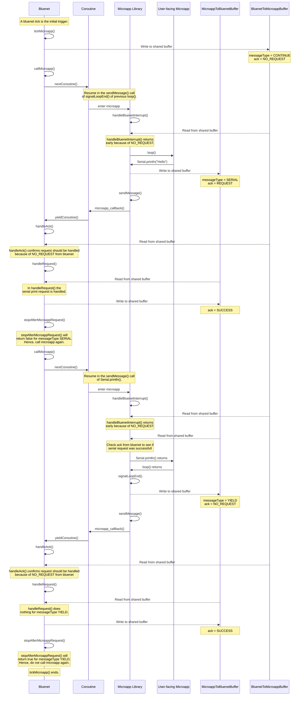

# Control flow

The control flow between bluenet and the microapp can in essence be described as follows (ignoring the initialization and `setup` for the moment):

Once every microapp tick, bluenet yields control towards the microapp, hoping that at some point it will yield back. The microapp will call its `loop` function. Often, the loop function will perform some task that requires bluenet, e.g. printing something to serial. Microapp will perform what can be thought of as a 'soft' yield: control is yielded back to bluenet to handle the request (e.g. sending the serial payload to uart), but the microapp expects to be handed back control once bluenet finishes handling the request. Upon completion of `loop` (or on a `delay` call within `loop`) the microapp will do a 'hard' yield: it yields without the expectations of being handed back control right away. Bluenet will then stop handing control to the microapp until the next microapp tick.

Interrupts function almost the exact same way as described above, with the exception that the initial trigger to enter the microapp comes from some predefined event within bluenet other than a tick.

In most cases, bluenet functions exactly as described above. However, there are some exceptions.
Firstly, if the microapp is doing too many consecutive soft yields, bluenet will not hand control back to the microapp after handling the request. Instead, the microapp is only called again next microapp tick or interrupt.
Secondly, bluenet throttles how many interrupts are passed through to the microapp per tick. Only after the next microapp tick will the microapp be able to receive interrupts again.
Thirdly, the microapp has a max number of 'nested' interrupts it can handle, since it has to store the context of each layer on a stack. At a certain depth it will drop incoming interrupts.
Upon a dropped interrupt, bluenet will not generate interrupts again until the microapp finishes existing interrupt handlers.
Lastly, though this is not a part of the main control flow, a watchdog in bluenet will keep track when a microapp gets stuck or takes up too much time. It will then reboot and disable the microapp. These mechanisms together should ensure that the microapp cannot compromise the internal working of bluenet and the crownstone in general.

## Context stacking
Every time a new interrupt comes in, the microapp will handle it immediately.
However, it will also want to store the original content of the shared buffers. This is important because there may be request return values in these buffers that the microapp has not handled yet. Also, the interrupt content from bluenet needs to be copied from the shared buffer because at any time bluenet may overwrite it with new interrupts.
Hence, before handling a new interrupt, the microapp will copy the contents of the shared buffers to an internal stack.
Once it finishes handling the interrupt, the top buffer can be popped from the stack and back to the shared buffer.
In most common use cases, an interrupt will be handled and return before bluenet generates another interrupt. However, when an interrupt handler generates too many consecutive requests, or contains async calls, bluenet may generate an interrupt before the previous one is finished. This leads to nested interrupts.
The microapp limits the maximum amount of concurrent interrupts via the maximum stack height. If the stack is full when a new interrupt is generated, the interrupt is dropped.

## Minimal example
Let's consider the following `loop()` in the microapp:
```
void loop() {
    Serial.println("Hello");
}
```
This is what is happening under the hood:



## Interrupt example
Now, consider that an interrupt handler has been registered for e.g. incoming mesh messages. A very simple microapp for this could look like this:

```
void callback(MeshMsg msg) {
    Serial.println("Hello");
}

void setup() {
    Mesh.setIncomingMeshMsgHandler(callback);
    Mesh.listen();
}

void loop() {
    // empty
}
```
The following sequence diagram shows what will happen when a mesh message of the microapp type is received in bluenet. Note that the original contents of the microapp request buffer are stored on the stack and restored after handling the interrupts so that the microapp will continue with the next tick call exactly in the same state as it was before the interrupt.

```mermaid
sequenceDiagram
    participant b as Bluenet
    participant c as Coroutine
    participant m as Microapp Library
    participant um as User-facing Microapp
    participant m2b as MicroappToBluenetBuffer
    participant b2m as BluenetToMicroappBuffer

    Note over b : An event of type EVT_RECV_MESH_MSG <br> is the initial trigger.
    b ->> b : handleEvent()
    b ->> b : onReceivedMeshMessage()
    Note over b : If the mesh message is not of <br> the microapp type, return early.
    b -->> b2m : Write to shared buffer
    Note over b2m : messageType = MESH <br> ack = REQUEST
    b ->> b : generateInterrupt()
    b ->> b : callMicroapp()
    b ->> c : nextCoroutine()
    Note over c,m : Resume in the sendMessage() call <br> of signalLoopEnd() of previous loop().
    c ->> m : enter microapp
    m ->> m : handleBluenetInterrupt()
    b2m -->> m : Read from shared buffer
    alt interrupt stack full
        Note over m : If the interrupt stack is full, <br> the microapp drops the interrupt.
        m -->> b2m : Write to shared buffer
        Note over b2m : ack = ERR_BUSY
        m ->> m : sendMessage()
        m ->> c : microapp_callback()
        c ->> b : yieldCoroutine()
        b ->> b : handleAck()
        b2m -->> b : Read from shared buffer
        Note over b : handleAck() will recognize <br> the microapp dropped the interrupt, <br> and will not call it again <br> until the microapp yields <br> or finishes handling an interrupt. <br> Microapp request is ignored.
        Note over b : generateInterrupt() ends.
    else interrupt stack not full
        Note over m : If there is space in the interrupt stack, <br> acknowledge bluenets interrupt
        m -->> b2m : Write to shared buffer
        Note over b2m : ack = IN_PROGRESS
        Note over m : handleBluenetInterrupt() copies <br> shared buffers to top of <br> request- and interrupt stacks.
        m ->> m : handleInterrupt()
        Note over m : handleInterrupt() identifies <br> the interrupt handler based on <br> messageType = MESH and <br> internal data of the mesh message.
        m ->> m : handleMeshInterrupt()
        m ->> um : callback()
        um ->> m : Serial.println("Hello")
        m -->> m2b : Write to shared buffer
        Note over m2b: messageType = SERIAL <br> ack = REQUEST
        m ->> m : sendMessage()
        m ->> c : microapp_callback()
        c ->> b : yieldCoroutine()
        b ->> b : handleAck()
        b2m -->> b : Read from shared buffer
        Note over b : On an IN_PROGRESS, <br> continue the interrupt.
        b ->> b : handleRequest()
        m2b -->> b : Read from shared buffer
        Note over b : In handleRequest() the <br> serial print request is handled.
        b -->> m2b : Write to shared buffer
        Note over m2b : ack = SUCCESS
        b ->> b : stopAfterMicroappRequest()
        Note over b : stopAfterMicroappRequest() will <br> return false for messageType SERIAL. <br> Hence, call microapp again.
        b ->> b : callMicroapp()
        b ->> c : nextCoroutine()
        Note over c,m : Resume in the sendMessage() call <br> of Serial.println().
        c ->> m : enter microapp
        m ->> m : handleBluenetInterrupt()
        b2m -->> m : Read from shared buffer
        Note over m : handleBluenetInterrupt() returns <br> early because ack is not REQUEST.
        m2b -->> m : Read from shared buffer
        Note over m : Check ack from bluenet to see if <br> serial request was successfull
        m ->> um : Serial.println() returns
        um ->> m : callback() returns
        m ->> m : handleMeshInterrupt() returns
        Note over m : The user handler or internal handler <br> may return a return code, e.g. SUCCESS
        m ->> m : handleInterrupt() returns
        Note over m : Continue in handleBluenetRequest()
        Note over m : Clear interrupt stack entry <br> and copy top request stack entry <br> back to shared buffer
        m -->> m2b : Write to shared buffer
        Note over m2b : messageType = YIELD <br> ack = SUCCESS
        m -->> b2m : Write to shared buffer
        Note over b2m : ack = SUCCESS
        m ->> m : sendMessage()
        m ->> c : microapp_callback()
        c ->> b : yieldCoroutine()
        b ->> b : handleAck()
        b2m -->> b : Read from shared buffer
        Note over b : handleAck() recognizes successfull <br> handling of interrupt. <br> Microapp request is ignored.
        Note over b : generateInterrupt() ends.
    end
```

