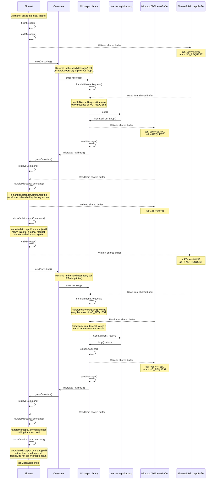

# Control flow

The control flow between bluenet and the microapp can in essence be described as follows (ignoring the initialization and `setup` for the moment):

Once every microapp tick, bluenet yields control towards the microapp, hoping that at some point it will yield back. The microapp will call its `loop` function. Often, the loop function will perform some task that requires bluenet, e.g. printing something to serial. Microapp will perform what can be thought of as a 'soft' yield: control is yielded back to bluenet to handle the request (e.g. sending the serial payload to uart), but the microapp expects to be handed back control once bluenet finishes handling the request. Upon completion of `loop` (or on a `delay` call within `loop`) the microapp will do a 'hard` yield: it yields without the expectations of being handed back control right away. Bluenet will then stop handing control to the microapp until the next microapp tick.

Interrupts function almost the exact same way as described above, with the exception that the initial trigger to enter the microapp comes from a specified event within bluenet.

In most cases, bluenet functions exactly as described above. However, there are some exceptions.
Firstly, if the microapp is doing too many consecutive soft yields, bluenet will not hand control back to the microapp after handling the request. Instead, the microapp is only called again next microapp tick or interrupt.
Secondly, bluenet throttles how many interrupts are passed through to the microapp per tick. Only after the next microapp tick will the microapp be able to receive interrupts again.
Lastly, though this is not a part of the main control flow, a watchdog in bluenet will keep track when a microapp gets stuck or takes up too much time. It will then reboot and disable the microapp. These mechanisms together should ensure that the microapp cannot compromise the internal working of bluenet and the crownstone in general.

## Minimal example
Let's consider the following `loop()` in the microapp:
```
void loop() {
    Serial.println("Loop");
}
```
This is what is happening under the hood:



As you may notice, that is quite a lot, even for such a minimal microapp. Next, we explore a situation with interrupts

## Interrupt example
Now, consider that an interruptHandler has been registered for e.g. incoming mesh messages. A very simple microapp for this could look like this:

```
void receivedMesh(MeshMsg msg) {
    Serial.println("Received mesh");
}

void setup() {
    Mesh.setIncomingMeshMsgHandler(receivedMesh);
    Mesh.listen();
}

void loop() {
    // empty
}
```


## Bluenet prohibits microapp call
Lastly, let's see how bluenet intervenes when the microapp does not yield quickly enough. Bluenet keeps track of consecutive calls to the microapp in a counter which is reset when the microapp makes a 'hard' yield, i.e. a yield at the end of `setup`, `loop`, a `delay` call or the end of an interrupt handler. If the counter reaches `MICROAPP_MAX_NUMBER_CONSECUTIVE_MESSAGES`, bluenet will not directly call `callMicroapp` again.
So, the following microapp will trigger this, if `NUMBER_SERIAL_CALLS` exceeds `MICROAPP_MAX_NUMBER_CONSECUTIVE_MESSAGES`:

```
void loop() {
    for(int i = 0; i < NUMBER_SERIAL_CALLS; i++) {
        Serial.println(i);
    }
}
```
The microapp will resume at `Serial.println()` on the next microapp tick.
However, it is possible that before the next microapp tick, an interrupt occurs. What happens then? The following sequence diagram shows this scenario.
