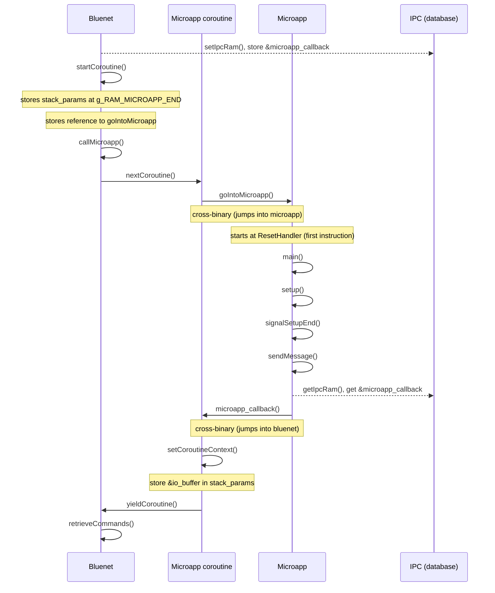

# Interaction bluenet and microapp

## First interaction
This is the first interaction between bluenet and a microapp.


## Tick calls
```mermaid
sequenceDiagram
	participant fw as Bluenet
	participant fw_app as Microapp coroutine
	participant app as Microapp
  Note over fw: Tick event
  fw ->> fw : tickMicroapp()
  loop while callAgain
	fw ->> fw : callMicroapp()
	fw ->> fw_app : nextCoroutine()
	Note over fw_app,app : Resume where last yielded
	fw_app ->> app : 
	Note over app : Continue microapp until sendMessage() call
	app ->> app : sendMessage()
	app ->> fw_app : microapp_callback()
	fw_app ->> fw_app : setCoroutineContext()
	fw_app ->> fw : yieldCoroutine()
	fw ->> fw : retrieveCommand()
	fw ->> fw : handleMicroappCommand()
  Note over fw: At end of setup, loop, or delay, stopAfterMicroappCommand returns true
  fw ->> fw : callAgain = !stopAfterMicroappCommand()
  end
  ```
## Interrupt calls
Todo
