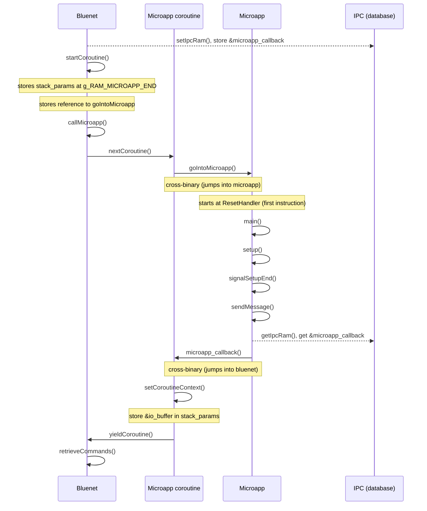
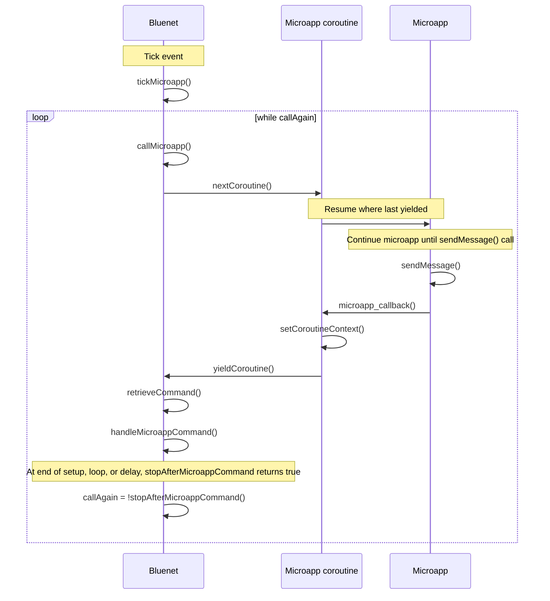
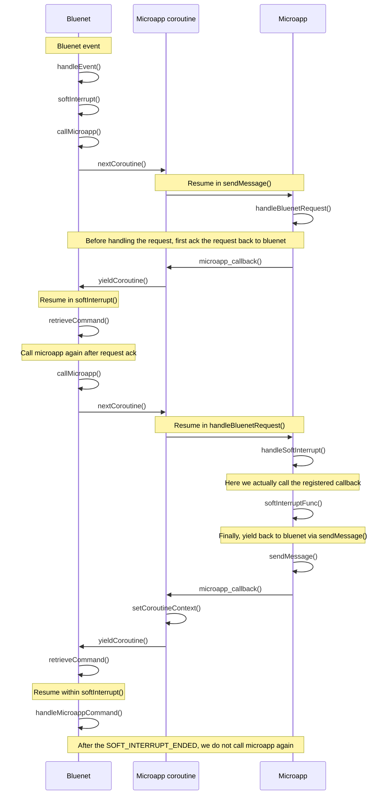

# Interaction bluenet and microapp

## First interaction
This is the first interaction between bluenet and a microapp.

```mermaid
%% https://mermaid-js.github.io/mermaid-live-editor/

sequenceDiagram
	participant fw as Bluenet
	participant fw_app as Microapp coroutine
	participant app as Microapp
	participant ipc as IPC (database)

	fw -->> ipc: setIpcRam(), store &microapp_callback

	fw ->> fw: startCoroutine()
	Note over fw: stores stack_params at g_RAM_MICROAPP_END
	Note over fw: stores reference to goIntoMicroapp

	fw ->> fw: callMicroapp()
	fw ->> fw_app: nextCoroutine()

    fw_app ->> app: goIntoMicroapp()
	Note over fw_app, app: cross-binary (jumps into microapp)
	Note over app: starts at ResetHandler (first instruction)

	app ->> app: main()
	app ->> app: setup()
	app ->> app: signalSetupEnd()
	app ->> app: sendMessage()

	app -->> ipc: getIpcRam(), get &microapp_callback

	app ->> fw_app: microapp_callback()
	Note over app,fw_app : cross-binary (jumps into bluenet)

	fw_app ->> fw_app: setCoroutineContext()
	Note over fw_app: store &io_buffer in stack_params

	fw_app ->> fw: yieldCoroutine()

	fw ->> fw: retrieveCommands()
```
## Tick calls

```mermaid
sequenceDiagram
	participant fw as Bluenet
	participant fw_app as Microapp coroutine
	participant app as Microapp
  Note over fw: Tick event
  fw ->> fw : tickMicroapp()
  loop while callAgain
	fw ->> fw : callMicroapp()
	fw ->> fw_app : nextCoroutine()
	Note over fw_app,app : Resume where last yielded
	fw_app ->> app : 
	Note over app : Continue microapp until sendMessage() call
	app ->> app : sendMessage()
	app ->> fw_app : microapp_callback()
	fw_app ->> fw_app : setCoroutineContext()
	fw_app ->> fw : yieldCoroutine()
	fw ->> fw : retrieveCommand()
	fw ->> fw : handleMicroappCommand()
  Note over fw: At end of setup, loop, or delay, stopAfterMicroappCommand returns true
  fw ->> fw : callAgain = !stopAfterMicroappCommand()
  end
```
## Interrupt calls

```mermaid
sequenceDiagram
	participant fw as Bluenet
	participant fw_app as Microapp coroutine
	participant app as Microapp
  Note over fw: Bluenet event
  fw ->> fw : handleEvent()
  fw ->> fw : softInterrupt()
	fw ->> fw : callMicroapp()
	fw ->> fw_app : nextCoroutine()
	Note over fw_app,app : Resume in sendMessage()
	fw_app ->> app : 
  app ->> app : handleBluenetRequest()
  Note over fw,app : Before handling the request, first ack the request back to bluenet
  app ->> fw_app : microapp_callback()
  fw_app ->> fw : yieldCoroutine()
  Note over fw : Resume in softInterrupt()
  fw ->> fw : retrieveCommand()
  Note over fw: Call microapp again after request ack
  fw ->> fw : callMicroapp()
  fw ->> fw_app : nextCoroutine()
  Note over fw_app,app : Resume in handleBluenetRequest()
  fw_app ->> app : 
  app ->> app : handleSoftInterrupt()
  Note over app : Here we actually call the registered callback
  app ->> app : softInterruptFunc()
	Note over app : Finally, yield back to bluenet via sendMessage()
	app ->> app : sendMessage()
	app ->> fw_app : microapp_callback()
	fw_app ->> fw_app : setCoroutineContext()
	fw_app ->> fw : yieldCoroutine()
	fw ->> fw : retrieveCommand()
  Note over fw : Resume within softInterrupt()
	fw ->> fw : handleMicroappCommand()
  Note over fw,app: After the SOFT_INTERRUPT_ENDED, we do not call microapp again
```
